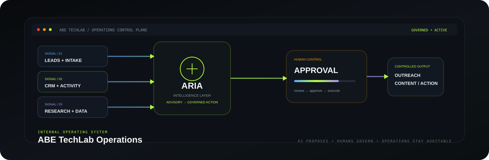
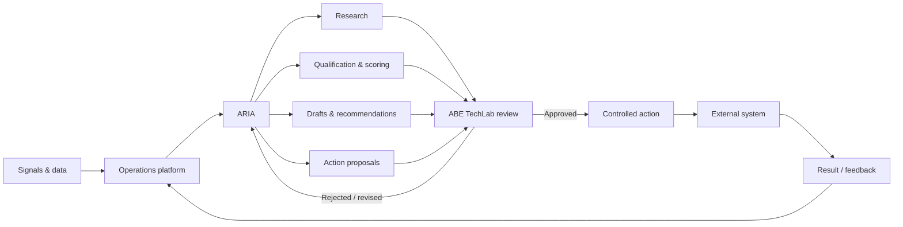
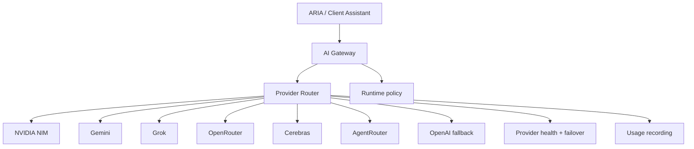
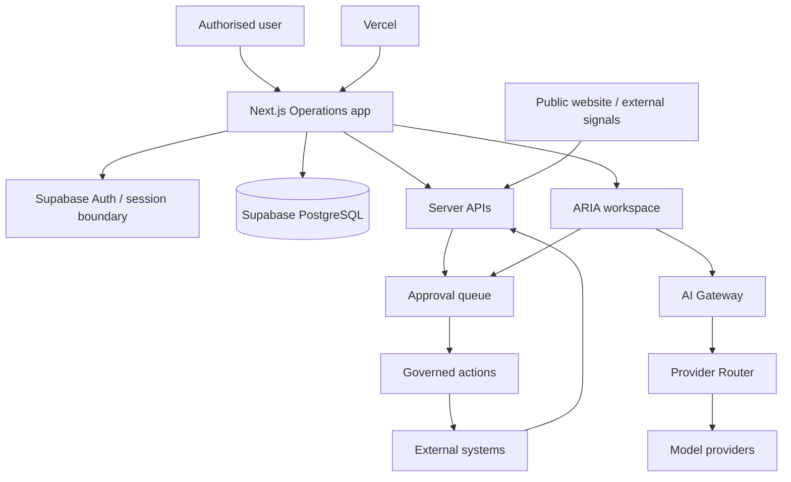

<a name="readme-top"></a>

<div align="center">



<p>
  
  
  
  
  
  
</p>

### A governed internal operating system for intelligence-led operations.


<p>
  <a href="#-the-30-second-version">Overview</a> ·
  <a href="#-operating-model">Operating model</a> ·
  <a href="#-aria-intelligence-layer">ARIA</a> ·
  <a href="#-architecture">Architecture</a> ·
  <a href="#-development">Development</a>
</p>

</div>

---

## ⚡ The 30-second version

**ABE TechLab Operations** is the internal operations platform that connects ABE TechLab's lead intelligence, customer relationship management (CRM), research, outreach, content operations, analytics, integrations, and the **ARIA** intelligence layer.

```text
SIGNALS + DATA
      ↓
OPERATIONS PLATFORM
      ↓
ARIA INTELLIGENCE
      ↓
HUMAN REVIEW / APPROVAL
      ↓
CONTROLLED EXTERNAL ACTION
      ↓
RESULTS RETURN TO OPERATIONS
```

The principle is simple:

> **AI proposes → ABE TechLab reviews → approved actions execute → results return.**

ARIA is the intelligence layer — **not the whole platform**. High-impact external actions remain approval-gated until the relevant automation is proven reliable.

<a href="#readme-top">↑ back to top</a>

---

## ✨ Operations surface

<table>
<tr>
<td width="50%" valign="top">

### 🗂️ CRM & pipeline
Organisations, contacts, leads, opportunities, activities, lead lifecycle, and operational dashboards.

### 🔎 Research
Organisation and market intelligence that feeds qualification, scoring, recommendations, and next actions.

### 📣 Outreach
Human-reviewed communication plans, drafts, follow-ups, and approval-aware execution.

</td>
<td width="50%" valign="top">

### 🧠 ARIA
Internal intelligence for research, classification, scoring, recommendations, drafting, monitoring, and governed action proposals.

### 📝 Content & attention
Operational content workflows plus surfaces for what needs attention, follow-up, or review.

### 🔌 Integrations
Website intake, email and future channels, analytics, GitHub, AI providers, and other operational services.

</td>
</tr>
</table>

<p align="center">
  
</p>

---

## 🔄 Operating model



This keeps intelligence useful without silently turning model output into business action.

---

## 🧠 ARIA intelligence layer

ARIA sits behind a shared AI gateway and provider router rather than being hard-wired to a single model provider.



The gateway separates agent behavior from model transport. Provider configuration, failover, model selection, usage recording, and provider health remain replaceable behind the routing layer.

### Governance modes

| Mode | Behaviour |
| --- | --- |
| `off` | Model execution disabled for the selected surface |
| `advisory` | Read-only intelligence, analysis, and recommendations |
| `action` | Reserved for governed write-capable tools and approval-routed actions |

Internal ARIA and the customer-facing Client Assistant can be paused independently.

---

## 🏗️ Architecture



### Technology stack

| Layer | Technology | Role |
| --- | --- | --- |
| Application | **Next.js 15** | Routing, UI, server APIs, application runtime |
| UI | **React 19** | Operations workspace and interactive surfaces |
| Language | **TypeScript 5** | Type-safe application code |
| Data & auth | **Supabase** | PostgreSQL, authentication, server/client data access |
| AI | **ARIA + shared gateway** | Internal intelligence and governed AI runtime |
| Hosting | **Vercel** | Production deployment, runtime, scheduled heartbeat |
| Quality | **ESLint + TypeScript + Vitest** | Linting, type-checking, and automated tests |

---

## 🎯 Operations Core v0.1

The first milestone is deliberately focused: build the smallest useful internal operating system before introducing autonomous execution.

```text
DASHBOARD
   ├── what is new?
   ├── what needs attention?
   ├── which opportunities matter most?
   ├── what is ARIA recommending?
   └── what happened recently?

CRM
   ├── organisations
   ├── contacts
   ├── leads
   ├── opportunities
   └── activities
```

Lead movement follows a defined lifecycle:

```text
New → Researching → Qualified → Outreach Ready → Contacted
    → Engaged → Opportunity → Won / Lost / Nurture
```

AI-generated scores are expected to retain the evidence and reasoning behind the score rather than becoming unexplained numbers.

---

## 💓 Supabase heartbeat

The application includes a lightweight health endpoint that performs a read against the isolated `system_heartbeat` table. It is infrastructure activity, not business-record creation.

```text
GET /api/health/supabase
```

A Vercel Cron configuration keeps the heartbeat available for scheduled infrastructure checks.

---

## 🚀 Development

Install dependencies and start the application:

```bash
npm install
npm run dev
```

Quality checks:

```bash
npm run lint
npm run typecheck
npm test
npm run build
```

Production deployment is managed through **Vercel** from `main`. Build and type-check failures should be resolved before production changes are considered live.

---

## 📚 Internal documentation

| Document | Purpose |
| --- | --- |
| [`docs/ARCHITECTURE.md`](./docs/ARCHITECTURE.md) | Core system architecture |
| [`docs/OPERATIONS-CORE-V0.1.md`](./docs/OPERATIONS-CORE-V0.1.md) | v0.1 product scope and success criteria |
| [`docs/AI_ARCHITECTURE.md`](./docs/AI_ARCHITECTURE.md) | AI gateway, provider router, ARIA boundaries |
| [`docs/AI_RUNTIME.md`](./docs/AI_RUNTIME.md) | AI runtime behaviour and policy |
| [`docs/AI_PROVIDER_SETUP.md`](./docs/AI_PROVIDER_SETUP.md) | Provider configuration guidance |
| [`docs/DATABASE-SCHEMA-V0.1.md`](./docs/DATABASE-SCHEMA-V0.1.md) | v0.1 database model |

---

## 🗺️ Roadmap

| Release | Focus |
| --- | --- |
| **Operations Core v0.1** | Auth, dashboard, CRM, lead pipeline, activity log, public lead intake, initial ARIA workspace |
| **ARIA v0.2** | Research, qualification, scoring, recommendations, outreach planning |
| **Automation v0.3** | Content, social publishing, email workflows, scheduled jobs, analytics |

Roadmap items describe direction, not a claim that every item is production-complete today.

---

## 🔐 Security & ownership

ABE TechLab Operations is a **private operational system in active development** even though the repository may be publicly viewable.

Security expectations include authenticated access, role-aware permissions, server-side secrets, auditability for material changes, separation of AI output from verified business facts, and approval gates around high-impact actions.

Never commit production credentials, provider API keys, Supabase privileged credentials, webhook secrets, or other private operational values. Deployment secrets belong in Vercel environment variables or an approved secrets manager.

This repository is **proprietary software**. Public GitHub access does not grant permission to reuse, redistribute, commercialise, or create derivative commercial systems from the code. See [`LICENSE`](./LICENSE) for the governing terms.

<div align="center">

<br />

**One control plane. Governed intelligence. Auditable operations.**

<a href="#readme-top">↑ back to top</a>

</div>
