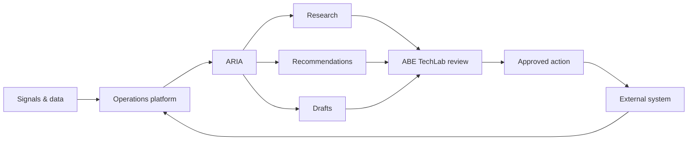

<div align="center">

# 🧭 ABE TechLab Operations

### The internal operating system for ABE TechLab.

<p>


</p>

**AI proposes → ABE TechLab reviews → approved actions execute → results return.**

</div>

---

## 🧭 What is it?

ABE TechLab Operations is the internal operations platform connecting the public ABE TechLab presence with lead intelligence, customer relationship management (CRM), research, outreach, content operations, analytics, GitHub, and the **ARIA** intelligence layer.

<table>
<tr><td width="50%">

### 🗂️ Operations
Organisations, contacts, leads, opportunities, activities, and operational dashboards.

### 🔎 Research
Organisation and market intelligence for informed decisions.

### 📣 Outreach
Approved communication plans and follow-ups.

</td><td width="50%">

### 📝 Content
Insights and social-content workflows.

### 🤖 ARIA
Research, classification, recommendations, drafting, monitoring, and controlled actions.

### 🔌 Integrations
Website, email, analytics, social platforms, GitHub, and future services.

</td></tr>
</table>

## 🔄 Operating model



<details open>
<summary><strong>🧠 ARIA boundary</strong></summary>

ARIA is the intelligence layer, not the whole platform. High-impact external actions remain approval-gated until the relevant automation is proven reliable.

</details>

<details>
<summary><strong>🗺️ Roadmap</strong></summary>

| Release | Focus |
| --- | --- |
| Operations Core v0.1 | Auth, dashboard, CRM, lead pipeline, activity log, public lead intake, initial ARIA workspace |
| ARIA v0.2 | Research, qualification, scoring, recommendations, outreach planning |
| Automation v0.3 | Content, social publishing, email workflows, scheduled jobs, analytics |

</details>

## 💓 Supabase heartbeat

The application includes a lightweight health endpoint that performs a read against the isolated `system_heartbeat` table. It is infrastructure activity, not business-record creation.

```text
GET /api/health/supabase
```

The repository also contains a Vercel Cron configuration for the heartbeat.

<details>
<summary><strong>🔐 Security</strong></summary>

Secrets must never be committed to Git. Production credentials belong in Vercel environment variables or an approved secrets manager.

</details>

## 🚀 Development

```bash
npm install
npm run dev
```

Production deployment is managed through Vercel from `main`. Build and type-check failures must be resolved before production changes are considered live.

## 📌 Status

**Internal platform in active development.**

## 🔐 Ownership

This repository contains proprietary internal software, operational workflows, and documentation. See [`LICENSE`](./LICENSE) for usage terms.
